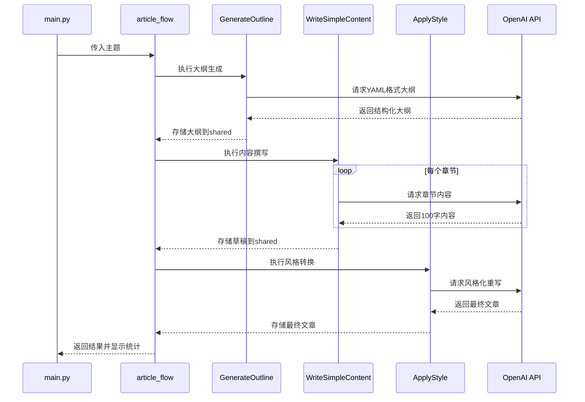
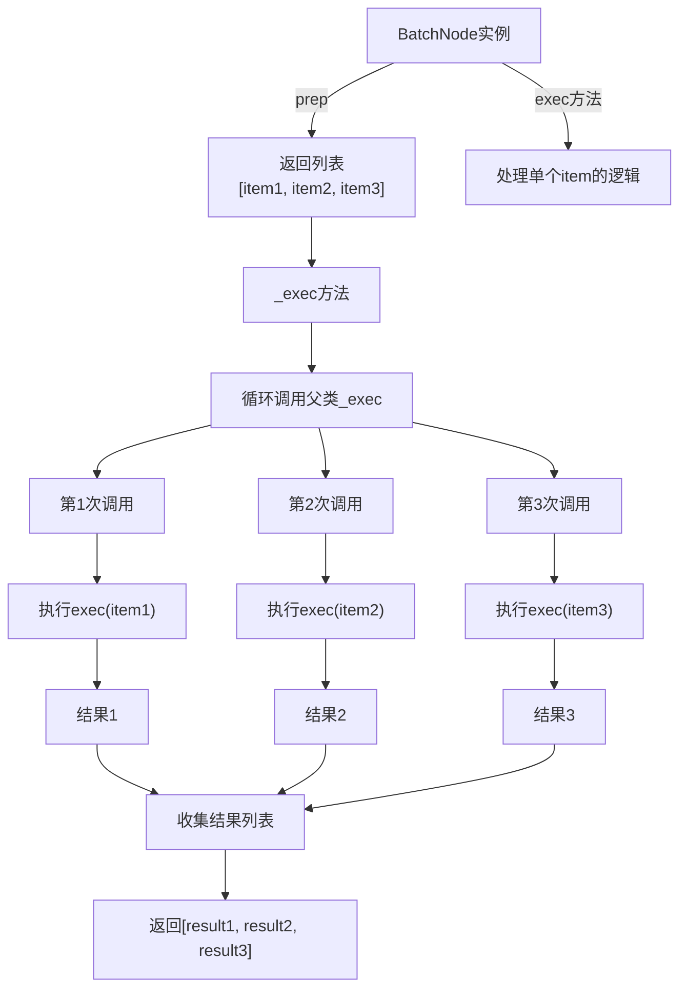
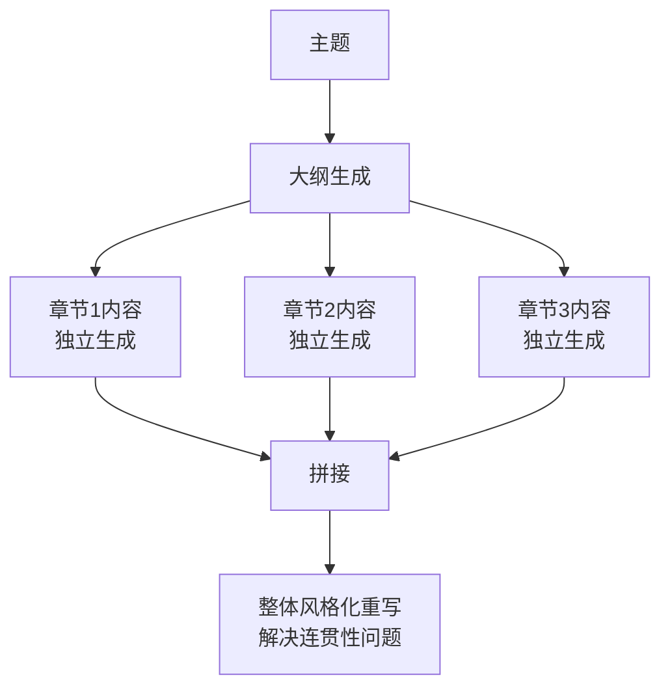

这是一个使用PocketFlow框架实现的**文章写作工作流**，通过串联多个LLM调用，将复杂的文章写作任务分解为有序的步骤。

## 工作流概述

这个工作流模拟了专业作者的创作过程，分为三个阶段：

1. **大纲生成**：先构思文章结构
2. **内容撰写**：为每个部分填充具体内容
3. **风格润色**：将内容转化为吸引人的文章

## 实现架构

### 1. **节点设计** (nodes.py)

工作流由三个核心节点组成，每个节点负责一个特定任务：

#### a) `GenerateOutline` - 大纲生成节点
```python
# 主要功能：
# 1. 接收主题
# 2. 生成最多3个部分的YAML结构化大纲
# 3. 解析并存储大纲数据

# 特点：
# - 使用YAML确保结构化输出
# - 限制最多3个部分，保持简洁
```

#### b) `WriteSimpleContent` - 内容撰写节点（批量处理）
```python
# 主要功能：
# 1. 接收大纲中的所有部分
# 2. 为每个部分并行生成100字以内的内容
# 3. 使用简单语言和类比解释

# 特点：
# - 继承BatchNode，支持批量处理
# - 显示进度提示
# - 严格字数限制
```

#### c) `ApplyStyle` - 风格应用节点
```python
# 主要功能：
# 1. 接收草稿内容
# 2. 应用对话式、吸引人的风格
# 3. 添加修辞问题、类比和结论

# 特点：
# - 专注于风格转换
# - 增强可读性和吸引力
```

### 2. **流程编排** (flow.py)

```python
# 使用>>操作符定义节点顺序
outline_node >> write_node >> style_node

# 创建流程
article_flow = Flow(start=outline_node)
```

### 3. **数据传递机制**

工作流使用`shared`字典在节点间传递数据：
- `shared["topic"]` → 原始主题
- `shared["outline"]` → 格式化大纲
- `shared["sections"]` → 大纲部分列表
- `shared["section_contents"]` → 各章节内容
- `shared["draft"]` → 初步草稿
- `shared["final_article"]` → 最终文章



**扩展可能性**

1. **添加新节点**：
   ```python
   # 例如添加事实检查节点
   outline_node >> write_node >> fact_check_node >> style_node
   ```

2. **参数化配置**：
   - 允许用户指定文章长度
   - 选择不同的写作风格
   - 调整详细程度

3. **多语言支持**：
   - 在LLM调用中指定语言
   - 添加翻译节点

4. **质量评估**：
   - 添加自动评分节点
   - 基于反馈迭代改进


## WriteSimpleContent如何实现章节内容写入
OutlineNode存储多个章节标题，在sections列表中
WriteNode通过BatchNode机制逐个拆解处理，且只有一个section_contents键，它的值包含所有章节内容【重点在于batchNode】
WriteNode最后整合，在post方法中构建完整字典


```python
class WriteSimpleContent(BatchNode):
    def prep(self, shared):
        # Get the list of sections to process and store for progress tracking
        self.sections = shared.get("sections", [])
        return self.sections
    
    def exec(self, section):
        prompt = f"""
Write a short paragraph (MAXIMUM 100 WORDS) about this section:

{section}

Requirements:
- Explain the idea in simple, easy-to-understand terms
- Use everyday language, avoiding jargon
- Keep it very concise (no more than 100 words)
- Include one brief example or analogy
"""
        content = call_llm(prompt)
        
        # Show progress for this section
        current_section_index = self.sections.index(section) if section in self.sections else 0
        total_sections = len(self.sections)
        print(f"✓ Completed section {current_section_index + 1}/{total_sections}: {section}")
        
        return section, content
    
    def post(self, shared, prep_res, exec_res_list):
        # exec_res_list contains [(section, content), (section, content), ...]
        section_contents = {}
        all_sections_content = []
        
        for section, content in exec_res_list:
            section_contents[section] = content
            all_sections_content.append(f"## {section}\n\n{content}\n")
        
        draft = "\n".join(all_sections_content)
        
        # Store the section contents and draft
        shared["section_contents"] = section_contents
        shared["draft"] = draft
        
        print("\n===== SECTION CONTENTS =====\n")
        for section, content in section_contents.items():
            print(f"--- {section} ---")
            print(content)
            print()
        print("===========================\n")
        
        return "default"
```

### BatchNode的实现分析

```python
class BatchNode(Node):
    def _exec(self, items): 
        return [super(BatchNode, self)._exec(i) for i in (items or [])]
```

这个实现的关键点：
- **继承链**: `BatchNode` → `Node` → `BaseNode`
- **方法重写**: `BatchNode`重写了`_exec`方法
- **执行方式**: 使用列表推导式 **顺序执行**

```python
# 当BatchNode被调用时的流程：

# 1. 调用_run方法（继承自BaseNode）
def _run(self, shared):
    p = self.prep(shared)      # 准备数据，返回列表
    e = self._exec(p)          # 批量执行
    return self.post(shared, p, e)

# 2. BatchNode的_exec实现
def _exec(self, items):
    # items是prep返回的列表，如["章节1", "章节2", "章节3"]
    results = []
    for item in (items or []):  # 实际是列表推导式，但等价于for循环
        # 对每个item调用父类的_exec方法
        result = super(BatchNode, self)._exec(item)  # 调用Node._exec
        results.append(result)
    return results

# 3. Node._exec的实现（批处理时每个item调用一次）
def _exec(self, prep_res):
    for self.cur_retry in range(self.max_retries):
        try:
            return self.exec(prep_res)  # 调用子类的exec方法
        except Exception as e:
            # ... 错误处理逻辑
```

**关键理解点：并没有创建多个Node**



### 与真正并行处理的对比
```python
# 真正的并行处理会使用并发库
import concurrent.futures

class ParallelBatchNode(BatchNode):
    def _exec(self, items):
        # 使用线程池并行执行
        with concurrent.futures.ThreadPoolExecutor() as executor:
            results = list(executor.map(
                lambda i: super()._exec(i), 
                items
            ))
        return results

# 或者使用asyncio
import asyncio

class AsyncBatchNode(BatchNode):
    async def _exec_async(self, items):
        tasks = [self._exec_item(i) for i in items]
        return await asyncio.gather(*tasks)
    
    def _exec(self, items):
        # 创建事件循环
        return asyncio.run(self._exec_async(items))
```

## 在文章写作工作流中的表现

```python
# 在WriteSimpleContent节点中的体现
class WriteSimpleContent(BatchNode):
    def exec(self, section):  # 每次处理一个章节
        # 这里显示进度
        print(f"正在处理章节: {section}")
        
        # 调用LLM（可能是同步阻塞的）
        content = call_llm(prompt)
        
        # 返回结果
        return section, content

# 执行时会看到：
# 1. "正在处理章节: Introduction" → 等待LLM响应 → 完成
# 2. "正在处理章节: Challenges" → 等待LLM响应 → 完成  
# 3. "正在处理章节: Strategies" → 等待LLM响应 → 完成
```

## BatchNode的设计优缺点

### 优点：
1. **简单易懂**：代码逻辑清晰
2. **错误处理统一**：继承Node的重试机制
3. **资源控制**：不会同时发起太多LLM请求
4. **顺序保证**：处理顺序与输入顺序一致

### 缺点：
1. **效率较低**：必须等待前一个完成
2. **无法利用并行**：LLM调用通常是IO密集型，适合并发

## 如何改进为真正的并行？

如果要实现真正的并行处理，可以这样修改：

```python
import threading
from concurrent.futures import ThreadPoolExecutor, as_completed

class ParallelBatchNode(Node):
    def __init__(self, max_workers=3, max_retries=1, wait=0):
        super().__init__(max_retries=max_retries, wait=wait)
        self.max_workers = max_workers
    
    def _exec_single(self, item):
        """处理单个item，包含重试逻辑"""
        for retry in range(self.max_retries):
            try:
                return self.exec(item)
            except Exception as e:
                if retry == self.max_retries - 1:
                    return self.exec_fallback(item, e)
                if self.wait > 0:
                    time.sleep(self.wait)
    
    def _exec(self, items):
        """并行处理所有items"""
        if not items:
            return []
        
        results = []
        with ThreadPoolExecutor(max_workers=self.max_workers) as executor:
            # 提交所有任务
            future_to_item = {
                executor.submit(self._exec_single, item): item 
                for item in items
            }
            
            # 收集结果，保持原始顺序
            results = [None] * len(items)
            item_to_index = {item: i for i, item in enumerate(items)}
            
            for future in as_completed(future_to_item):
                item = future_to_item[future]
                try:
                    result = future.result()
                    index = item_to_index[item]
                    results[index] = result
                except Exception as e:
                    # 处理异常
                    pass
        
        return results
```

## 总结

您提供的`BatchNode`实现：
1. **确实是顺序执行**，不是并行
2. **没有创建多个Node实例**，而是重复调用同一个实例的`exec`方法
3. **通过列表推导式循环处理**，每个item必须等前一个完成

这种设计对于简单的批处理任务足够用，但如果需要高性能的并行处理，需要：
1. 使用线程池或进程池
2. 考虑异步IO（asyncio）
3. 实现更复杂的错误处理和结果收集

在文章写作这个具体场景中，顺序执行可能是故意的设计选择：
1. **避免API速率限制**：OpenAI API有请求频率限制
2. **控制成本**：避免同时发起太多收费请求
3. **简化错误处理**：顺序执行更容易调试和重试
4. **保持章节顺序**：确保输出顺序与大纲一致

## 个人洞察
虽然当前内容是顺序执行，但是并没有充分利用顺序执行的优点，比如都是先写大纲再填充内容，就可以将之前缩写的内容或者思路提供给后续大纲的补充。这里没有这样做，而是所有节点执行之后用重写的方法使之连贯。

### 当前设计的局限性与权衡
当前工作流的设计思路：


这种设计存在您指出的**连贯性问题**：
- 章节之间缺乏逻辑联系
- 重复或矛盾的信息
- 需要最后的重写来"弥补"连贯性问题

### 可能的改进方案

#### 方案1：顺序依赖的上下文传递
```python
class WriteSequentialContent(Node):  # 不是BatchNode
    def exec(self, shared):
        sections = shared["sections"]
        section_contents = {}
        previous_content = None  # 跟踪前一个章节的内容
        
        for i, section in enumerate(sections):
            # 构建考虑上下文的提示词
            prompt = f"""
            Write content for section: {section}
            
            Previous context:
            {previous_content if previous_content else "This is the first section."}
            
            Requirements:
            - Build upon the previous content naturally
            - Avoid repeating information
            - Create smooth transitions
            - Keep it under 100 words
            """
            
            content = call_llm(prompt)
            section_contents[section] = content
            previous_content = content  # 更新为下一章提供上下文
        
        return section_contents
```

#### 方案2：两阶段内容生成
```python
class EnhancedContentGeneration(Node):
    def exec(self, shared):
        # 第一阶段：并行生成初始草稿
        initial_drafts = self._parallel_generate(shared)
        
        # 第二阶段：基于整体上下文精修
        refined_content = self._refine_with_context(shared, initial_drafts)
        
        return refined_content
    
    def _parallel_generate(self, shared):
        # 并行生成各章节初始内容
        sections = shared["sections"]
        results = []
        for section in sections:
            prompt = f"Write initial content about {section}"
            results.append(call_llm(prompt))
        return results
    
    def _refine_with_context(self, shared, drafts):
        # 基于所有草稿的上下文精修每个章节
        refined = {}
        for i, (section, draft) in enumerate(zip(shared["sections"], drafts)):
            # 构建包含相邻章节的上下文
            context = {
                "previous": drafts[i-1] if i > 0 else None,
                "current": draft,
                "next": drafts[i+1] if i < len(drafts)-1 else None
            }
            
            prompt = f"""
            Refine this section considering the overall article:
            
            Section: {section}
            Current draft: {draft}
            
            Previous section content: {context['previous'] or 'N/A'}
            Next section content: {context['next'] or 'N/A'}
            
            Ensure smooth transitions and logical flow.
            """
            
            refined[section] = call_llm(prompt)
        
        return refined
```

### 为什么选择当前设计？

#### 权衡考虑：
1. **简单性 vs 复杂性**
```python
# 简单设计（当前）
大纲 → 独立生成章节 → 风格化重写

# 复杂设计（改进）
大纲 → 生成章节1 → 生成章节2(依赖1) → 生成章节3(依赖1+2) → 全局优化
```

2. **性能 vs 质量**
```python
# 并行（当前）：
# Pros: 快速，适合API调用
# Cons: 连贯性差

# 顺序（改进）：
# Pros: 连贯性好
# Cons: 慢（章节数 × API延迟）
```

3. **容错性**
```python
# 独立章节：
# - 一个章节失败不影响其他章节
# - 可以单独重试失败章节

# 依赖章节：
# - 第一章失败 → 所有后续章节无法生成
# - 重试可能破坏上下文连贯性
```

#### 业务场景假设：
当前设计可能假设：
1. 章节之间的独立性较强（如：介绍、挑战、策略是相对独立的）
2. 最终风格化可以解决大部分连贯性问题
3. 速度和可靠性比完美连贯性更重要

### 具体改进建议

#### 改进1：增加大纲细化的中间步骤
```python
class EnhanceOutline(Node):
    """在大纲和内容生成之间添加逻辑连接"""
    def exec(self, shared):
        sections = shared["sections"]
        prompt = f"""
        For the article outline: {sections}
        
        For each section, provide:
        1. Key points to cover
        2. Connection to previous/next section
        3. Key terms to use consistently
        
        Output in structured format.
        """
        enhanced_outline = call_llm(prompt)
        return enhanced_outline
```

#### 改进2：上下文感知的内容生成
```python
class ContextAwareBatchNode(BatchNode):
    def __init__(self, context_window=1):
        super().__init__()
        self.context_window = context_window  # 考虑前后几个章节
    
    def exec(self, item_with_context):
        """接收带上下文信息的item"""
        section, index, all_sections = item_with_context
        
        # 获取上下文章节（如果有）
        context_sections = all_sections[max(0, index-self.context_window):index]
        
        prompt = f"""
        Write about {section}
        
        Context from previous sections: {context_sections}
        
        Ensure this section builds upon and connects to the previous content.
        """
        return section, call_llm(prompt)
```

#### 改进3：渐进式改进工作流
```python
# 分阶段工作流
graph LR
    Outline[大纲] --> Draft[并行草稿]
    Draft --> Refine[顺序精修]
    Refine --> Style[风格优化]
    
    subgraph 精修阶段
        Refine1[精修第1章] --> Refine2[精修第2章<br/>考虑第1章]
        Refine2 --> Refine3[精修第3章<br/>考虑第1-2章]
    end
```

### 设计选择的原则

#### 何时选择当前设计（独立+重写）：
1. **内容模块化强**：各章节高度独立
2. **快速原型**：需要快速看到完整结果
3. **容错要求高**：不希望一个错误影响全部
4. **后期编辑多**：人类编辑会大幅修改

#### 何时选择依赖设计（顺序生成）：
1. **逻辑连贯性要求高**：教程、故事叙述
2. **术语一致性关键**：技术文档
3. **构建性内容**：后一章依赖前一章的知识
4. **短文章**：API调用次数可控

### 实践建议

基于您的需求，可以考虑以下实践：

```python
# 根据文章类型选择策略
def create_workflow(topic, article_type):
    if article_type == "technical":
        # 技术文档：需要更强的连贯性
        return create_sequential_workflow()
    elif article_type == "blog":
        # 博客文章：可以接受一定独立性
        return create_parallel_workflow()
    elif article_type == "tutorial":
        # 教程：必须顺序依赖
        return create_dependent_workflow()
    else:
        return create_default_workflow()
```