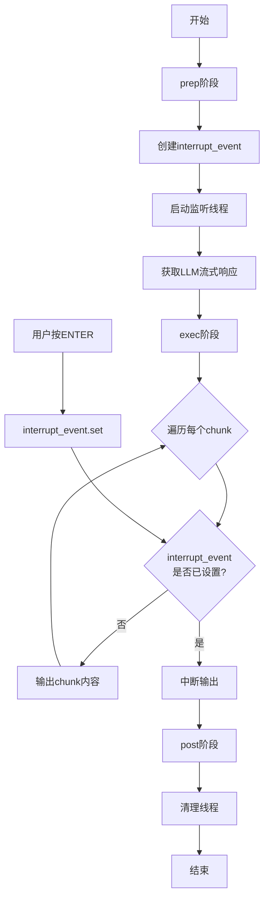

这段代码实现了一个**流式LLM响应生成器**，支持**用户随时中断**功能。

## 代码核心功能

### 1. **流式输出LLM响应**
- 实时逐块显示LLM生成的内容（类似ChatGPT的打字效果）
- 使用`stream_llm(prompt)`获取生成器，逐块产生响应

### 2. **用户中断机制**
- 允许用户在生成过程中随时按ENTER键停止生成

## 关键组件：`interrupt_event`

`interrupt_event`是一个**线程间通信工具**，用于在主线程（生成LLM响应）和监听线程（等待用户输入）之间传递信号：

### 工作原理：

```python
# 1. 创建事件对象
interrupt_event = threading.Event()
# 初始状态为 False（未设置）

# 2. 监听线程等待用户输入
def wait_for_interrupt():
    input("Press ENTER...")  # 阻塞等待用户输入
    interrupt_event.set()    # 用户按ENTER后，设置事件为True

# 3. 主线程检查事件状态
while generating_response:
    if interrupt_event.is_set():  # 检查用户是否按了ENTER
        break  # 中断生成
```

### 具体流程：

1. **初始化**：
   ```python
   interrupt_event = threading.Event()  # 创建事件，初始为False
   ```

2. **监听线程启动**：
   - 启动一个后台线程专门等待用户输入
   - 用户按ENTER → `interrupt_event.set()` → 事件变为True

3. **主线程检查**：
   - 每输出一个chunk前检查：`if interrupt_event.is_set():`
   - 如果为True，立即中断循环，停止生成

4. **清理阶段**：
   ```python
   # 确保监听线程正常退出
   interrupt_event.set()  # 再次设置，确保线程能退出
   listener_thread.join() # 等待线程结束
   ```

## 代码执行流程



## 重要特性

1. **非阻塞设计**：
   - 监听线程独立运行，不阻塞主线程
   - 主线程可以同时生成响应和监听中断

2. **线程安全通信**：
   - `threading.Event`是线程安全的
   - 一个线程`.set()`，其他线程`.is_set()`能立即看到

3. **优雅退出**：
   - 中断后确保监听线程被正确清理
   - 避免僵尸线程

## 使用场景

这种模式特别适合：
- **长文本生成**：用户可以随时停止
- **实时对话系统**：允许用户打断AI的回复
- **资源控制**：防止生成过长或无关内容

## 扩展可能性

可以进一步改进：
```python
# 1. 添加超时中断
interrupt_event.wait(timeout=30)  # 30秒后自动停止

# 2. 多种中断方式
# （如特定关键词、网络请求等）

# 3. 保存已生成内容
# 即使中断，也保留已生成的部分
```

这个设计模式在需要**用户可控的流式处理**场景中非常有用。