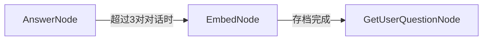
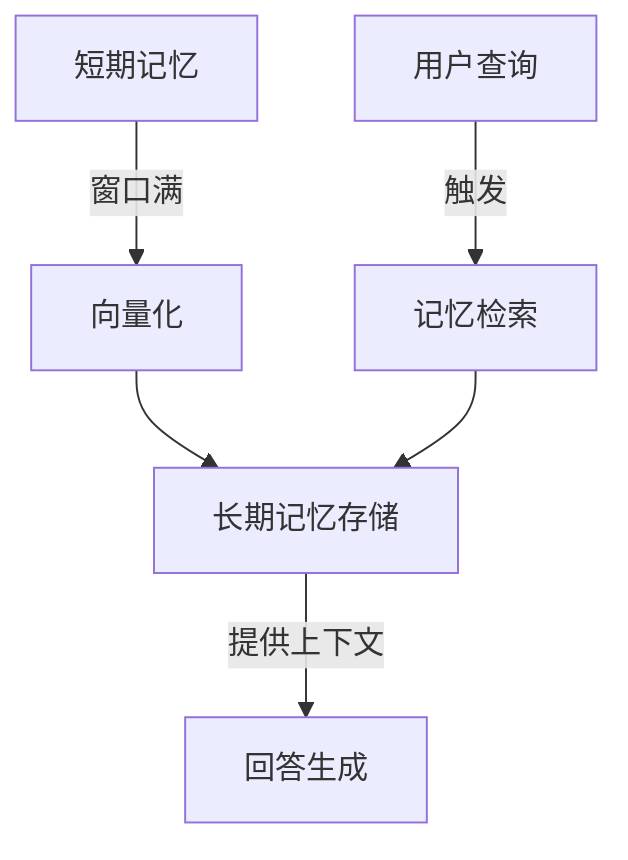

这是一个基于PocketFlow构建的带记忆功能的聊天应用项目。

```
pocketflow-chat-memory/
├── main.py              # 应用入口
├── flow.py              # 流程定义
├── nodes.py             # 节点实现
├── requirements.txt     # 依赖包
├── utils/               # 工具模块
│   ├── __init__.py
│   ├── call_llm.py     # LLM调用
│   ├── get_embedding.py # 嵌入向量生成
│   └── vector_index.py  # 向量索引操作
└── README.md            # 项目说明
```

## 1. 核心循环路径
```python
def create_chat_flow():
    # Create the nodes
    question_node = GetUserQuestionNode()
    retrieve_node = RetrieveNode()
    answer_node = AnswerNode()
    embed_node = EmbedNode()

    # Main flow path
    question_node - "retrieve" >> retrieve_node
    retrieve_node - "answer" >> answer_node
    
    # When we need to embed old conversations
    answer_node - "embed" >> embed_node
    
    # Loop back for next question
    answer_node - "question" >> question_node
    embed_node - "question" >> question_node
    
    # Create the flow starting with question node
    return Flow(start=question_node)
```
```
用户输入 → 检索记忆 → 生成回答 → 存储记忆 → 下一轮输入
      ↑___________________________________________↓
```

## 2. 核心功能
### 2.1 GetUserQuestionNode

`GetUserQuestionNode` 是整个聊天流程的**入口节点**，负责处理**用户交互**和**对话状态初始化**。它是对话循环的起点和连接点，确保对话能够持续进行。

```python
class GetUserQuestionNode(Node):
    def prep(self, shared):
        """初始化对话状态，只在第一次运行时执行"""
        if "messages" not in shared:
            shared["messages"] = []
            print("Welcome to the interactive chat! Type 'exit' to end the conversation.")
        
        return None
    
    def exec(self, _):
        """获取并处理用户输入"""
        # Get interactive input from user
        user_input = input("\nYou: ")
            
        # Check if user wants to exit
        if user_input.lower() == 'exit':
            return None
            
        return user_input
    
    def post(self, shared, prep_res, exec_res):
        """更新状态并决定下一个节点"""
        # 处理退出情况
        if exec_res is None:
            print("\nGoodbye!")
            return None  # 结束整个流程
            
        # 更新消息历史
        shared["messages"].append({"role": "user", "content": exec_res})
        
        # 决定下一个节点：总是去检索节点
        return "retrieve"
```

### 2.2 AnswerNode

`AnswerNode` 是整个聊天流程的**核心处理节点**，负责**整合上下文、调用LLM生成回答、管理对话状态**。它是连接用户输入和AI输出的桥梁，同时控制着记忆存档的触发时机。

```python
class AnswerNode(Node):
    def prep(self, shared):
        """准备LLM的上下文"""
        # 检查是否有消息历史
        if not shared.get("messages"):
            return None
            
        # 1. 获取最近3对对话（短期记忆窗口），6条消息（3对对话）平衡了上下文长度和记忆负担
        recent_messages = shared["messages"][-6:] if len(shared["messages"]) > 6 else shared["messages"]
        
        # 2. 如果有检索到的相关对话，添加到上下文
        context = []
        if shared.get("retrieved_conversation"):
            context.append({
                "role": "system", 
                "content": "The following is a relevant past conversation that may help with the current query:"
            })
            context.extend(shared["retrieved_conversation"])
            context.append({
                "role": "system", 
                "content": "Now continue the current conversation:"
            })
        
        # 3. 添加最近的对话
        context.extend(recent_messages)
        
        return context

    
    def exec(self, messages):
        """使用LLM生成回答"""
        if messages is None:
            return None

        response = call_llm(messages)
        return response
    
    def post(self, shared, prep_res, exec_res):
        """处理LLM响应并决定下一步"""
        # 检查是否有有效结果
        if prep_res is None or exec_res is None:
            return None  # End the conversation
        
        # 打印助手的回答
        print(f"\nAssistant: {exec_res}")
        
        # 将助手回答添加到消息历史
        shared["messages"].append({"role": "assistant", "content": exec_res})
        
        # 如果超过6条消息（3对对话），触发存档，转到`EmbedNode`
        if len(shared["messages"]) > 6:
            return "embed"
        
        # 否则继续下一轮问题，转到`GetUserQuestionNode`
        return "question"
```

### 2.3 EmbedNode

`EmbedNode` 是整个聊天系统的**长期记忆管理节点**，负责将短期对话转换为**向量化长期记忆**，实现信息的持久化存储和检索准备。它是系统从“瞬时记忆”到“持久记忆”的桥梁。

记忆转换与存储：


```python
class EmbedNode(Node):

    def prep(self, shared):
        """提取最旧的对话对进行嵌入存档"""
        if len(shared["messages"]) <= 6:
            return None # 不超过3对对话，无需存档
            
        # 提取最旧的用户-助手对（前两条消息）
        oldest_pair = shared["messages"][:2]
        # 从当前消息中移除这对话对
        shared["messages"] = shared["messages"][2:]
        
        return oldest_pair

    def exec(self, conversation):
        """将对话转换为嵌入向量"""
        if not conversation:
            return None
            
        # 提取用户和助手消息
        user_msg = next((msg for msg in conversation if msg["role"] == "user"), {"content": ""})
        assistant_msg = next((msg for msg in conversation if msg["role"] == "assistant"), {"content": ""})
        # 组合成一个文本用于嵌入
        combined = f"User: {user_msg['content']} Assistant: {assistant_msg['content']}"
        
        # 生成嵌入向量（已归一化）
        embedding = get_embedding(combined)
        
        return {
            "conversation": conversation, # 原始对话对
            "embedding": embedding # 对应的向量表示
        }
    
    def post(self, shared, prep_res, exec_res):
        """将嵌入向量存储到索引中"""
        if not exec_res:
            # 没有要嵌入的内容，直接继续
            return "question"
            
        # 初始化向量索引（如果不存在）
        if "vector_index" not in shared:
            shared["vector_index"] = create_index()
            shared["vector_items"] = []  # 用于存储对应的对话内容
            
        # 添加向量到索引
        position = add_vector(shared["vector_index"], exec_res["embedding"])
        # 存储对应的对话内容
        shared["vector_items"].append(exec_res["conversation"])
        
        # 用户反馈
        print(f"✅ Added conversation to index at position {position}")
        print(f"✅ Index now contains {len(shared['vector_items'])} conversations")
        
        # 存档完成后继续对话
        return "question"
```

分离式存储策略：
```python
# 两个独立的存储结构：
vector_index: numpy数组，存储纯向量数据（用于高效计算）
vector_items: Python列表，存储原始对话（用于内容检索）
```

优势：
1. 计算效率：向量索引使用numpy，优化了数值计算
2. 内存效率：只保留一份原始数据，向量索引轻量
3. 检索便利：通过索引找到位置，直接获取对应内容

向量化策略深入：

1. 文本预处理：清晰文本、标准化格式
2. 为什么需要归一化？ 余弦相似度 = (A·B) / (|A|·|B|)，如果向量已经归一化，|A|=|B|=1，余弦相似度 = A·B（点积），计算更高效。

缓存策略：
```python
class CachedEmbedNode(EmbedNode):
    def __init__(self):
        self.embedding_cache = {}  # 文本->向量的缓存
        
    def get_cached_embedding(self, text):
        """获取缓存的嵌入向量"""
        cache_key = hash(text)  # 或使用更稳定的哈希
        
        if cache_key in self.embedding_cache:
            return self.embedding_cache[cache_key]
        
        # 计算新嵌入
        embedding = get_embedding(text)
        self.embedding_cache[cache_key] = embedding
        return embedding
```

### 2.4 RetrieveNode

`RetrieveNode` 是整个聊天系统的**记忆检索引擎**，负责从长期记忆中**寻找与当前问题最相关的历史对话**，为AnswerNode提供额外的上下文信息。它是系统实现"记忆召回"功能的核心。

记忆检索与上下文增强：


```python
class RetrieveNode(Node):

    def prep(self, shared):
        """准备检索查询和向量索引"""
        if not shared.get("messages"):
            return None
            
        # 获取最新的用户消息作为查询文本
        latest_user_msg = next((msg for msg in reversed(shared["messages"]) 
                                if msg["role"] == "user"), {"content": ""})
        
        # 检查是否有可检索的向量索引
        if ("vector_index" not in shared or 
            "vector_items" not in shared or 
            len(shared["vector_items"]) == 0):
            return None # 没有长期记忆，无法检索
            
        return {
            "query": latest_user_msg["content"],
            "vector_index": shared["vector_index"],
            "vector_items": shared["vector_items"]
        }
    
    def exec(self, inputs):
        """执行向量相似度搜索"""
        if not inputs:
            return None
            
        query = inputs["query"]
        vector_index = inputs["vector_index"]
        vector_items = inputs["vector_items"]
        
        print(f"🔍 Finding relevant conversation for: {query[:30]}...")
        
        # 生成查询的嵌入向量
        query_embedding = get_embedding(query)
        
        # 搜索最相似的向量（k=1表示只返回最相似的一个）
        indices, distances = search_vectors(vector_index, query_embedding, k=1)
        
        if not indices:
            return None
            
        # 获取对应的对话内容
        conversation = vector_items[indices[0]]
        
        return {
            "conversation": conversation,
            "distance": distances[0] # 余弦距离（0-2之间，越小越相似）
        }
    
    def post(self, shared, prep_res, exec_res):
        """存储检索结果并决定下一步"""
        if exec_res is not None:
            shared["retrieved_conversation"] = exec_res["conversation"]
            print(f"📄 Retrieved conversation (distance: {exec_res['distance']:.4f})")
        else:
            shared["retrieved_conversation"] = None
        
        return "answer" # 总是继续到AnswerNode
```


## 整个Flow的设计亮点分析



**亮点**：实现了记忆的完整闭环：
- **记忆形成**：对话 → 短期记忆 → 长期记忆
- **记忆利用**：查询 → 检索 → 上下文增强
- **记忆更新**：新对话持续丰富知识库
